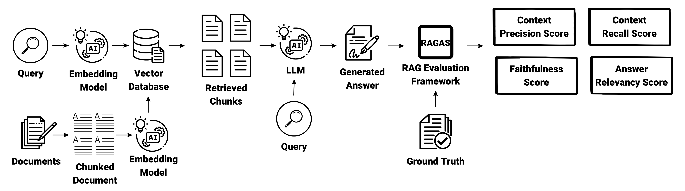

# Evaluate RAG with RAGAS, LangChain, and LLaMA3-Qdrant

This repository contains a Jupyter Notebook designed to evaluate the performance of the Retrieval-Augmented Generation (RAG) model. The evaluation is conducted by comparing the model's responses to a set of predefined questions against ground truth answers. The questions are specifically related to the Llama model, a series of language models developed by Meta AI.

# Embeddings Model
Embeddings are a crucial component in natural language processing (NLP) tasks, including RAG models. They convert text into numerical vectors that capture semantic meaning. The choice of embedding model significantly affects the performance of RAG because it influences how well the model can understand and retrieve relevant information.

# Why Choice of Embedding Model Affects RAG Performance
The quality and characteristics of embeddings determine how effectively the RAG model can match queries with relevant documents. High-quality embeddings capture nuanced semantic relationships, leading to better retrieval and generation performance. Conversely, poor-quality embeddings can result in irrelevant or inaccurate responses.

# Evaluating RAG with RAGAS
RAGAS (Retrieval-Augmented Generation Assessment) is a tool designed to evaluate RAG applications. It provides metrics and methodologies to assess the performance of RAG models by comparing their responses to ground truth answers. This notebook leverages RAGAS to systematically evaluate the RAG model's performance, offering insights into its strengths and areas for improvement.

# Related Article
This repository is based on the article "Mastering RAG: Choosing the Right Vector Embedding Model for Your RAG Application
" published on the Medium. The article provides a detailed overview of the evaluation process and its implications for RAG model development. You can read the full article [here](https://quamernasim.medium.com/mastering-rag-choosing-the-right-vector-embedding-model-for-your-rag-application-bbb57517890e).

# Conclusion
The choice of embedding model plays a critical role in determining the performance of RAG models. By evaluating RAG with RAGAS, LangChain, and LLaMA3-Qdrant, we can gain valuable insights into the model's capabilities and limitations. This evaluation process helps researchers and developers optimize RAG models for specific tasks and domains, leading to more effective and accurate natural language processing applications.